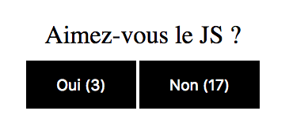

# Clic !

## Exo 1 : compteur

Créer un compteur de clics.

## Exo 2 : sondage

On peut cliquer sur deux boutons, et il faut compter le nombre de clics sur chacun d'eux :

## Exo 3 : couleurs

1. Tester si c'est la `value` est une couleur
	=> Il faut que ça commence par un #
	=> Il faut que la longueur fasse 4 (#FFF) ou 7 (#FFFFFF)

2. Si ce n'est pas une couleur, écrire un message d'erreur.

3. Si c'est une couleur, on l'ajoute au `<ul>`.

### BONUS

* On met le `<li>` dans la couleur de la couleur tapée

* On supprime la valeur de l'input à la soumission
